# trackwise.js

**Privacy-first, drop-in usability tracker for any website.** Record clicks, rage clicks, dead clicks, scroll depth, form friction, JS errors and Core Web Vitals — then render a click heatmap right on the live page.




---

## Why trackwise.js?

- **Zero-dependency, ~32 KB minified** — one script tag and you are done.
- **Usability signals, not just hits** — rage clicks, dead clicks, misclicks, erratic scrolling, form abandonment.
- **Privacy by default** — form values are never recorded, PII is scrubbed from text, URLs are stripped of query strings, sensitive fields are redacted, and Do-Not-Track is respected.
- **Bring your own backend** — POST batches to your endpoint, or intercept events with `onLog()` and route them anywhere.
- **Heatmaps for free** — `renderHeatmap()` draws click density on the live page; `getHeatmapData()` gives you the raw grid.

## Quick start

### 1. Script tag (drop-in)

```html
<script src="https://unpkg.com/trackwise.js/dist/trackwise.min.js"
        data-endpoint="/api/usability-tracking"></script>
```

That's it. The tracker auto-initializes from its `data-*` attributes.

### 2. npm / bundlers

```bash
npm install trackwise.js
```

```js
import TrackWise from 'trackwise.js';

TrackWise.init({
  endpoint: '/api/usability-tracking',
  onLog: (event) => console.log(event.type, event)
});
```

### 3. Try the local demo

```bash
npm install && npm run build
npm run demo            # serves the demo page at http://localhost:5173

# in a second terminal — optional: run the example receiver
cd examples/node-receiver && npm install && npm start
```

Open the demo, rage-click a button, half-fill the form, scroll erratically — then hit **Toggle heatmap**.

## Configuration

Pass options to `TrackWise.init({...})`, as `data-*` attributes on the script tag,
or as a global `window.TRACKWISE_CONFIG = {...}` object (attributes win).

| Option | Data attribute | Default | Description |
| --- | --- | --- | --- |
| `endpoint` | `data-endpoint` | `null` | URL that receives `POST` batches. `null` = local-only (export via API). |
| `enabled` | `data-enabled` | `true` | Master switch (set `false` until user consents). |
| `autoTrack` | — | `true` | Register all collectors on start. |
| `sampleRate` | `data-sample-rate` | `1` | Sample visitors `0..1` (deterministic by visitor id). |
| `flushIntervalMs` | `data-flush-interval` | `5000` | Batch send interval (min `1000`). |
| `maxQueueSize` | `data-max-queue-size` | `300` | Events held in memory before flushing. |
| `mousemoveThrottleMs` | `data-mousemove-throttle` | `250` | Mousemove sampling rate. |
| `scrollThrottleMs` | `data-scroll-throttle` | `250` | Scroll sampling rate. |
| `rageClick` | — | `{threshold: 3, windowMs: 1000, radiusPx: 40, cooldownMs: 5000}` | Rage-click detector tuning. |
| `deadClickMs` | — | `600` | Wait time before classifying a click as dead. |
| `scrubUrl` | `data-scrub-url` | `true` | Strip query string + hash from recorded URLs. |
| `captureText` | `data-capture-text` | `true` | Record clicked element text (sanitized). |
| `captureScroll` / `captureForms` / `captureErrors` / `captureKeyboard` / `captureMouseMove` / `capturePerf` | matching `data-capture-*` | `true` | Toggle individual collectors. |
| `hashText` | `data-hash-text` | `false` | Hash element text instead of truncating it. |
| `blockSelectors` | `data-block-selectors` | `['[data-tw-no-track]']` | Elements that are never tracked. |
| `allowSelectors` | `data-allow-selectors` | `null` | If set, only these elements have their text captured. |
| `redactSelectors` | — | `['[data-tw-redact]']` | Elements always reported as `[REDACTED]` (inputs are always redacted). |
| `respectDoNotTrack` | `data-respect-dnt` | `true` | Honor the DNT header. |
| `debug` | `data-debug` | `false` | Log every event to the console. |
| `transport` | — | `null` | `async (events, envelope) => boolean` custom sender (beacon/fetch used otherwise). |
| `onLog` | — | `null` | Called with every event as it is recorded. |
| `transform` | — | `null` | `(event) => event | false` — mutate or drop events before queueing. |

> Mark any element with `data-tw-no-track` to exclude it (and its children) entirely.

## API

```js
TrackWise.init(options)        // start tracking (idempotent)
TrackWise.start() / stop()     // pause & resume collectors
TrackWise.track(name, data)    // custom event (data is PII-redacted)
TrackWise.getLogs()            // array of events recorded this page
TrackWise.exportJSON()         // pretty-printed JSON of all logs
TrackWise.clearLogs()
TrackWise.flush()              // send batch now → Promise<{sent}>
TrackWise.onLog(cb)            // subscribe to every event → unsubscribe fn
TrackWise.renderHeatmap(opts)  // draw click heatmap on the page
TrackWise.clearHeatmap()
TrackWise.getHeatmapData()     // { cells: [{x, y, count}], total }
TrackWise.getSessionId() / getVisitorId()
TrackWise.setEndpoint(url)
TrackWise.setEnabled(bool)     // consent gate
TrackWise.isTracking()
TrackWise.stats()              // queue + session introspection
```

### Heatmap

```js
TrackWise.renderHeatmap({ radius: 30, alpha: 0.5, color: '255, 60, 60' });
TrackWise.clearHeatmap();

const { cells, total } = TrackWise.getHeatmapData({ cellSize: 50 });
// cells sorted by count desc: [{ x, y, col, row, count }]
```

## Event catalog

| Event | Emitted when |
| --- | --- |
| `pageview` | Initial load + SPA navigation (`pushState`/`replaceState`/`popstate`/`hashchange`) |
| `click` | Any click, with privacy-safe target descriptor + page coordinates |
| `mousemove` | Throttled pointer sampling |
| `mouseleave` | Pointer leaves the viewport |
| `rage_click` | ≥3 clicks in the same spot within 1s |
| `dead_click` | Click on non-interactive element with no DOM/navigation response |
| `misclick` | Click near (but not on) an interactive control |
| `scroll` | Scroll gesture ends (page or inner scroll container) |
| `scroll_depth` | 25 / 50 / 75 / 90 / 100% of the page reached |
| `erratic_scroll` | ≥6 direction reversals within 2s |
| `form_focus` / `form_input` / `form_change` | Field interaction (length only — **never values**) |
| `form_error` | Browser validation failure |
| `form_submit` | Form submitted, with hesitation & field focus duration |
| `form_abandon` | Focused field left without submitting (tab hidden / navigation) |
| `keyboard` | Navigation keys only (Tab, Enter, Escape, arrows…) — typed characters are never captured |
| `js_error` / `promise_rejection` | Uncaught errors and rejections (message, stack, source — PII-scrubbed) |
| `visibility` | Tab shown / hidden |
| `resize` | Viewport resized |
| `perf` | Navigation timing (TTFB, DOM interactive, load) |
| `web_vitals` | LCP + CLS, reported when the page is hidden |
| `custom` | `TrackWise.track('checkout', {...})` |

Every event carries: `id`, `type`, `seq`, `timestamp`, `t` (ms since load), `sessionId`, `visitorId`, `page {url, path, title}`, `viewport {w, h}`.

## Sending data somewhere

### Your endpoint

```html
<script src="trackwise.js" data-endpoint="https://analytics.example.com/collect"></script>
```

Batches are sent with `navigator.sendBeacon` when the page is hidden and `fetch(keepalive)` otherwise. Failed batches are re-queued with exponential backoff, and pending events survive reloads (persisted to `localStorage`).

```jsonc
// POST /api/usability-tracking
{
  "sdk": "trackwise.js",
  "version": "1.0.0",
  "sessionId": "ses_lx3f9a2k",
  "visitorId": "vis_8d2m1qp",
  "sentAt": "2026-10-04T09:15:22.413Z",
  "count": 1,
  "dropped": 0,
  "events": [
    {
      "id": "evt_k3j9xa",
      "type": "rage_click",
      "seq": 14,
      "timestamp": "2026-10-04T09:15:21.882Z",
      "t": 4213,
      "sessionId": "ses_lx3f9a2k",
      "visitorId": "vis_8d2m1qp",
      "page": { "url": "https://example.com/pricing", "path": "/pricing", "title": "Pricing" },
      "viewport": { "w": 1440, "h": 900 },
      "count": 3,
      "target": {
        "tag": "button",
        "id": "upgrade",
        "classes": "btn btn-primary",
        "text": "Upgrade now",
        "interactive": true,
        "path": "section#plans > button.btn.btn-primary"
      }
    }
  ]
}
```

### Example receiver included

A complete Express receiver (validates, persists to NDJSON, exposes a summary endpoint) lives in [`examples/node-receiver`](examples/node-receiver):

```bash
cd examples/node-receiver && npm install && npm start
# POST events to http://localhost:3000/api/trackwise
# GET  summary from http://localhost:3000/api/trackwise/summary
```

### Any other sink

```js
TrackWise.init({
  onLog(event) {
    if (event.type === 'rage_click') myErrorTracker.capture('rage', event);
  }
});

// or batch to GA / Segment / your own queue:
TrackWise.init({
  transport(events, envelope) {
    return fetch('/api/collect', {
      method: 'POST',
      keepalive: true,
      headers: { 'content-type': 'application/json' },
      body: JSON.stringify(envelope)
    }).then((r) => r.ok);
  }
});
```

## Privacy

trackwise.js is designed so a stranger's read of your logs cannot reconstruct personal data:

- **Form values are never read** — only field names, types and string *lengths*.
- **Sensitive fields are redacted** — `password`/`email`/`tel` inputs, `contenteditable`, `[data-tw-redact]`.
- **Text is scrubbed** — emails, card-like numbers and phone patterns in clicked text are replaced with `[REDACTED]` (or hashed with `hashText: true`).
- **URLs are stripped** — query strings, hashes and `user:pass@` credentials are removed.
- **Keystrokes** — only navigation keys are recorded; typed characters are discarded.
- **Custom payloads** — `track(name, data)` redacts keys like `password`, `token`, `secret`, `email`…
- **Do Not Track** is honored; gate startup behind consent with `enabled: false` + `setEnabled(true)`.

> Heuristic caveat: `dead_click`/`misclick` are inferred from DOM behavior. SPAs that respond to clicks without mutating the DOM may be under-counted.

## Development

```bash
npm install
npm run build     # esbuild → dist/ (ESM + CJS + IIFE readable/minified)
npm test          # node --test — unit + jsdom integration suites
```

Project layout:

```
src/
  core/        config, session, queue, flusher, tracker
  collectors/  clicks, mouse, scroll, forms, page, errors, keyboard
  privacy/     sanitization & redaction
  viz/         heatmap renderer
  utils/       storage, throttle, ids
test/          unit + jsdom integration tests
demo/          interactive demo page
examples/      node-receiver example server
```

## License

[MIT](LICENSE)
